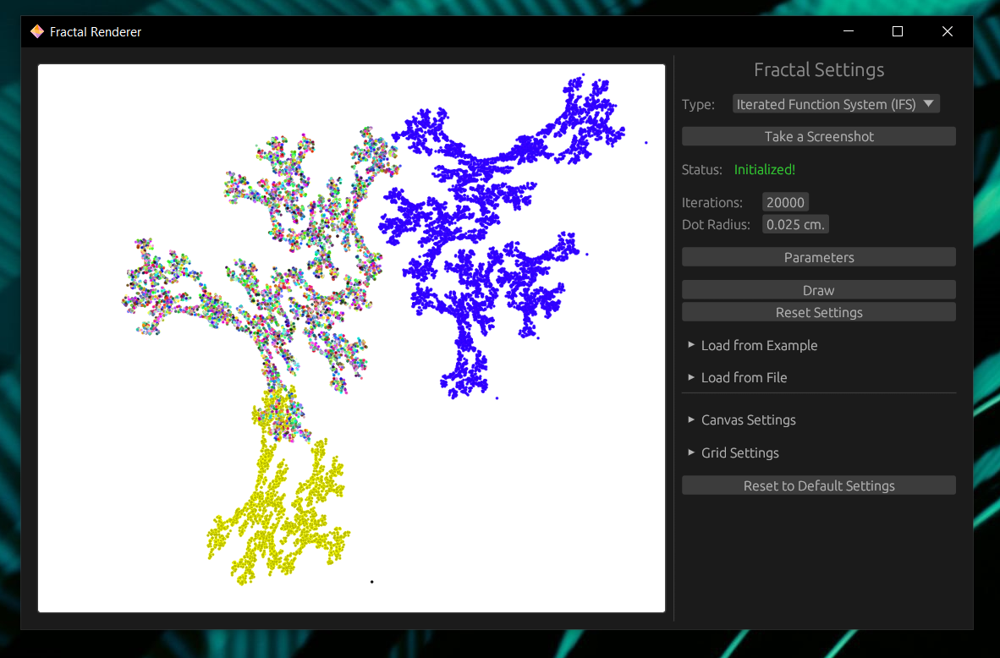
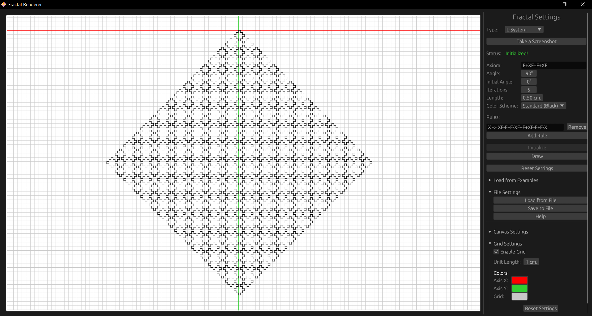

# Fractal Renderer

**Rust-based**🦀 project for rendering simple **IFS** *(Iterated function system)* and **L-System** *(Lindenmayer system)* fractals.


---

**FractalRenderer** is a Rust project for rendering fractals. It originated from two separate university lab projects focused on L-System and Iterated Function System (IFS) fractals.

These projects were later merged and adapted for **WebAssembly (WASM)**, allowing fractals to be rendered directly in a web browser.



## Features
- **L-System Fractals:** Generate complex patterns using Lindenmayer systems.
- **IFS Fractals:** Create simple visuals with Iterated Function Systems.
- **WASM Integration:** Leverage the power of Rust and WASM for web-based rendering.
- **Modular Design:** Organized and maintainable codebase, designed for extensibility.

## Technologies Used
- [**egui**](https://github.com/emilk/egui): Used for building graphical user interfaces in Rust.
- [**WebAssembly**](https://webassembly.org): Enables high-performance rendering in web environments.
- [**Trunk**](https://trunkrs.dev): Build and bundle the application for the web.

## Running (Native)

### Precompiled Binaries

Precompiled binaries for Windows, Linux and MacOS can be found in the [latest releases](https://github.com/xairaven/FractalRenderer/releases/latest).

### Building from Source

1. Ensure you are using the latest stable version of Rust:
   ```bash
   rustup update
   ```

2. Build and run the application:
   ```bash
   cargo run --release
   ```

### Additional Dependencies (Linux)

On Linux systems, you may need to install the following dependencies:

   ```bash
   sudo apt install libxcb-render0-dev libxcb-shape0-dev libxcb-xfixes0-dev libxkbcommon-dev libssl-dev
   ```

### Additional Dependencies (Fedora)

On Fedora systems, you may need to install:

   ```bash
   dnf install clang clang-devel clang-tools-extra libxkbcommon-devel pkg-config openssl-devel libxcb-devel gtk3-devel atk fontconfig-devel
   ```

## Running the Web Application Locally

You can compile the app to WASM and test it locally:

1. Install the required Rust target:
   ```bash
   rustup target add wasm32-unknown-unknown
   ```

2. Install Trunk:
   ```bash
   cargo install --locked trunk
   ```

3. Build and serve the application:
   ```bash
   trunk serve
   ```

   Open your browser and navigate to `http://127.0.0.1:8080/index.html#dev`. This bypasses caching for development.

> [!NOTE]
> The `assets/sw.js` script enables offline functionality by caching the app. Using the `#dev` suffix skips this caching during development.

### Deploying the Web Application

1. Build the application for production:
   ```bash
   trunk build --release
   ```

2. The output will be in the `dist` directory. You can upload it to any static hosting provider (e.g., GitHub Pages).

## License

This project is licensed under the [MIT License](LICENSE).

## Acknowledgments

- University lab projects that laid the foundation for this work.
- The Rust and WebAssembly communities for their amazing tools and resources.

## Contributing

Contributions are welcome! Please fork the repository and create a pull request with your changes.

